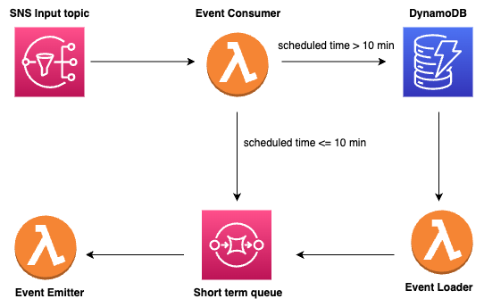

## AWS Serverless scheduler

This code is a simplified and redesigned version of @bahrmichael's [repo](https://github.com/bahrmichael/aws-scheduler).
Right now this repo is only capable of scheduling webhook-related tasks


## Deploy

This section explains how you can deploy the service yourself. Once set up use it like shown above.
The following picture shows you the structure of the service.



### Prerequisites
You must have the following tools installed:
- serverless framework 1.48.3 or later
- node
- npm
- python3
- pip

### Setup

1) Complete the variable names in `scheduler/settings.py` (based on the names that you have in `serverless.yml`)
2) Run `scripts/init_services.py` to create the complementary services (dynamo table, SQS and SNS)
3) Run `npm i serverless-python-requirements` for python requirments installer
4) Deploy the cloudformation stack with `sls deploy`

## Usage

### Input

To schedule a trigger you have to publish an event which follows the structure below to the ARN of the input topic. You can find the ARN in the console logs after deploying

```json
{
  "date": "utc timestamp following ISO 8601",
  "url": "the url that will receive the scheduled request",
  "method": "http method for calling the url", 
  "payload": "any payload that your endpoint might need to receive",
  "headers": "any headers that your endpoint might need to receive",
  "cookies": "any cookies that your endpoint might need to receive",
}
```

date, url and method fields are mandatory.

```python
# Python example for scheduling a telegram message 10 minutes later 
import json
import boto3
from datetime import datetime, timedelta

client = boto3.client('sns')
token = "<YOUR_TELEGRAM_BOT_TOKEN>"
chat_id="<YOUR_TELEGRAM_CHAT_ID>"
message = "Your first scheduled message!"

data = f'chat_id={chat_id}&text={message}'

date = (datetime.utcnow() + timedelta(minutes=10)).isoformat()

event = {
        "date": date,
        "url": f'https://api.telegram.org/bot{token}/sendMessage?{data}',
        "method": "post"
        }

input_topic = "arn:aws:sns:{YOUR_AWS_REGION}:{YOUR_AWS_ACCOUNT_ID}:{YOUR_INPUT_TOPIC_NAME}"
client.publish(TopicArn=input_topic, Message=json.dumps(event))
```


## Limitations

- Events may arrive more than once
- Check your AWS Lambda concurrent execution quota, if you send too many messages at the same time you might drown your lambdas
-  This approach costs more than using DynamoDB's TTL attribute. If delays of 30 minutes to 48 hours are acceptable for you, then check out [this article](https://medium.com/swlh/scheduling-irregular-aws-lambda-executions-through-dynamodb-ttl-attributes-acd397dfbad9). 

## TODOs
- Add batch processing for SQS and SNS messages
- Add an abstraction `Scheduler` to use this architecture without friction
- secure the PoC with test